# Monkey Typer - A C++ SFML Typing Game 🐵⌨️
**A fun and challenging typing game built with C++ and SFML.**

---

## 🎮 Game Overview
Monkey Typer is a dynamic game designed to test and improve your typing speed and accuracy. Words fly across the screen, and your goal is to type them correctly before they disappear or reach the edge. Compete for high scores, customize your gameplay experience, and enjoy various visual styles!

**Key Technologies Used**:
`C++` `SFML (Simple and Fast Multimedia Library)` `CMake` `fmtlib`

---

## ✨ Key Features
-   **Dynamic Word Spawning:** Words appear from the side of the screen, moving towards the opposite edge.
-   **Single & Linked Words:** Type individual words or challenging sequences of linked words.
-   **Scoring System:** Earn points for correctly typed words, with bonuses for linked words.
-   **High Score Tracking:** Compete against yourself and see your name on the leaderboard.
-   **Customizable Gameplay:**
    *   Adjust word speed and spawn rate.
    *   Change font size and style.
    *   Toggle typing highlight and input display methods.
    *   Enable/disable linked words and randomize fonts/word sets.
-   **Multiple Word Sets:** Play with different dictionaries or create your own.
-   **Visual Feedback:** Clear indicators for typed characters, mistakes, and completed words.
-   **Game Over & Statistics:** Detailed performance breakdown after each game, including WPM and accuracy.
-   **Score Progress Graphs:** Visualize your performance over time for each high score.

---

## 🔧 Project Structure & Core Components

```mermaid
graph TD
    A[MonkeyTyperGame ■Core Game Loop■] --> B[UIManager];
    A --> C[Word & LinkedWord ■Gameplay Objects■];
    A --> D[SettingsManager];
    A --> E[HighScoreManager];
    A --> F[FontManager];
    A --> G[WordDatabaseManager];

    B --> H[Button ■UI Element■];
    B --> I[TextAnimation ■UI Element■];

    C --> J[SFML Graphics ■Rendering■];
    B --> J;
    A --> J;

    D -- Loads/Saves --> K[settings.cfg];
    E -- Loads/Saves --> L[highscores.txt];
    F -- Loads --> M[Font Files ■*.ttf, *.otf■];
    G -- Loads --> N[Word Files ■*.txt■];
```



**Core Classes:**

*   **`MonkeyTyperGame`**: The central class orchestrating the game loop, game states, and interactions between managers.
*   **`UIManager`**: Manages all non-gameplay UI screens (Menu, Settings, High Scores, Game Over), button interactions, and UI rendering.
*   **`Word` / `LinkedWord`**: Represent the words the player types. `LinkedWord` is a sequence of `Word` parts. They handle their own movement, input processing, and visual state.
*   **`SettingsManager`**: Loads, saves, and provides access to all game settings (speed, font, etc.).
*   **`HighScoreManager`**: Manages the list of high scores and their associated game history.
*   **`FontManager`**: Loads and provides access to different font files.
*   **`WordDatabaseManager`**: Loads and provides words from different dictionary files/sets.
*   **`Button`**: A reusable UI button component.
*   **`TextAnimation`**: A simple class for animating text (e.g., for settings screen examples).
*   **`Constants.h`**: Defines global game constants like window size, speeds, colors.

---

## ⚙️ Technical Implementation Details

### Game States
The game operates using a state machine to manage different screens and functionalities.


### Data Persistence
-   **Settings:** Game settings are saved to `util/settings.cfg`.
-   **High Scores:** High scores and basic game stats are saved to `util/highscores.txt`.
-   **Fonts:** Loaded from the `fonts/` directory. New `.ttf` or `.otf` files can be added here.
-   **Word Lists:** Loaded from `.txt` files in the `dictionary/` directory.

### Build System
-   The project uses **CMake** for building.
-   **SFML 2.6.1** and **fmtlib 9.1.0** (or specified versions) are fetched and built automatically using `FetchContent` during the CMake configuration phase.
-   The project is configured for **static linking** against SFML to produce a more self-contained executable.

---

## 🛠️ How to Build & Run

### Prerequisites
*   A C++17 compatible compiler (e.g., GCC, Clang, MSVC)
*   CMake (version 3.14 or higher recommended)
*   Git (for `FetchContent` to download libraries)
*   **(On Linux)** Development libraries for SFML dependencies if not automatically resolved by your system or SFML's static build (e.g., `libxrandr-dev`, `libudev-dev`, `libopenal-dev`, `libfreetype6-dev`, `libvorbis-dev`, `libflac-dev`, `libgl1-mesa-dev`, `libx11-dev`, etc.).
*   **(On Windows with MinGW)** You might need to ensure GCC, G++, and Make are in your PATH, or use an IDE that manages the MinGW environment.

### Build Steps
1.  **Clone the repository:**
    ```bash
    git clone https://github.com/Z01berg/Monkey_Typer.git
    cd Monkey_Typer 
    ```

2.  **Create a build directory and configure CMake:**
    ```bash
    mkdir build
    cd build
    cmake .. 
    ```
    *   **On Windows with Visual Studio:** You might need to specify a generator, e.g.:
        `cmake .. -G "Visual Studio 17 2022"` (Replace with your VS version).
    *   **On Windows with MinGW (from Git Bash or MSYS2):**
        `cmake .. -G "MinGW Makefiles"`

3.  **Build the project:**
    ```bash
    cmake --build .
    ```
    *   Or, if using Makefiles (Linux/MinGW): `make`
    *   Or open the generated solution/project file in your IDE (e.g., Visual Studio solution in the `build` directory).

4.  **Run the executable:**
    The executable `monkey_typer` (or `monkey_typer.exe` on Windows) will be located in the build directory (e.g., `build/` for Makefiles, or `build/Debug/` or `build/Release/` for IDEs like Visual Studio).
    The necessary asset folders (`fonts/`, `dictionary/`, `util/`) should be copied next to the executable during the build process (check `CMAKE_RUNTIME_OUTPUT_DIRECTORY` in CMake if they are not).

    ```bash
    # From the build directory:
    ./monkey_typer 
    # or (Windows):
    # .\monkey_typer.exe
    # or (if in Debug subfolder):
    # ./Debug/monkey_typer.exe
    ```

---

## FUTURE DEVELOPMENT Ideas & Potential Improvements (not for now)
-   [ ] Different game modes (e.g., timed challenges, survival until first mistake).
-   [ ] More visual themes or animated backgrounds.
-   [ ] Sound effects for typing, word completion, errors, and menu interactions.
-   [ ] Power-ups (e.g., slow down words, clear screen, score multiplier).
-   [ ] More detailed post-game statistics (e.g., per-character mistake analysis, consistency graph).
-   [ ] Difficulty levels affecting word length, complexity, or speed scaling.
-   [ ] Achievements or unlockables.

---

## 📜 License
This project is licensed under the **MIT License**. See the `LICENSE.txt` file for details.
SFML is licensed under the zlib/png license.
fmtlib is licensed under the MIT license.

---
